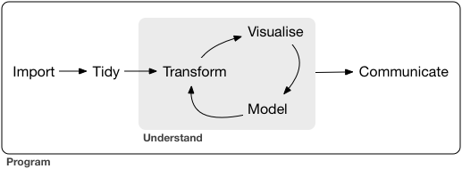

class: inverse, center, middle

# Proceed with caution!

## These slides are built with a (very) old version of the package.

## The code in these slides may not still work, but may still be useful in understanding the usage of the package.

# All theory is still relevant.


---
class: inverse, center

```{r setup, include=FALSE}
options(htmltools.dir.version = FALSE)
knitr::opts_chunk$set(echo = FALSE, message=FALSE, warning = FALSE, cache=TRUE, fig.width = 12)
library(tidyverse)
library(lubridate)
library(fpp2)
library(fasster)
library(knitr)
library(kableExtra)
library(tsibble)

theme_set(theme_gray(base_size = 23))
```

```{r setup_data}
pedestrian <- rwalkr::run_melb(
  year = 2015:2017,
  sensor = "Southern Cross Station",
  na.rm = TRUE)

pedestrian <- as_tsibble(pedestrian, index = Date_Time)

is_weekend <- function(DateTime){
  wday(DateTime) %in% c(1, 7)
}
```


# Sub-daily time-series are complex

<hr>

--

.pull-left[
## Multiple seasonality
## Exogenous regressors
## Lots of data
]
.pull-right[
## Dynamic features
## Holiday effects
## More noise and missings
]

---
class: inverse, center, bottom

background-image: url(resources/pedestrian.jpeg)
background-size: cover

# Pedestrian counts

---

## Key example: Pedestrian counting

```{r}
ped_reg_plot <- pedestrian %>%
  filter(Date_Time > as.Date("2017-3-27") & Date_Time < as.Date("2017-4-24")) %>% 
  mutate(series = "Hourly counts")
ped_agg_plot <- ped_reg_plot %>%
  tsummarise(
    Date = date(Date_Time),
    Count = sum(Count)) %>%
  mutate(series = "Daily counts",
         Date_Time = ymd_h(paste(Date, 12)))

ggplot() +
  geom_line(aes(x=Date_Time, y=Count), data = ped_agg_plot) + 
  geom_line(aes(x=Date_Time, y=Count), data = ped_reg_plot) +
  facet_grid(series~., scales="free_y") + 
  ylab("Pedestrians counted") + 
  xlab("Date") +
  ggtitle("Temporal granularity in pedestrian traffic at Sthrn Cross Stn")
```

---
class: inverse, center, top

background-image: url(resources/electricity.jpeg)
background-size: cover

# Electricity demand

---

## Key example: Electricity demand

```{r}
class(elecdemand) <- c("msts", "mts", "ts")

elecdemand_plot <- elecdemand %>%
  as_tibble %>%
  mutate(DateTime = seq(ymd_hms("2014-01-01 00:00:00", tz="ADST"), by=as.difftime(minutes(30)), length.out = NROW(elecdemand))) %>%
  as_tsibble(index=DateTime)

elecdemand_plot %>%
  filter(DateTime < ymd("2014-02-01")) %>%
  gather("Series", "Value", Demand, Temperature) %>%
  ggplot(aes(x=DateTime, y=Value, group=Series)) +
  geom_line() +
  facet_grid(Series ~ ., scales = "free_y") + 
  ylab("Electricity demanded (GW)") + 
  xlab("Date") + 
  ggtitle("Electricity demanded and temperature")
```

???

An interesting feature of electricity demand is how strongly it relates with Temperature. 
This illustrates the importance of allowing exogenous regressors in a model for predicting these patterns.

---
class: inverse, center, middle

# Suggested models for 
# multiple seasonality

---

### Regression models

.center[
### Multiple Linear Regression
### Generalised Additive Models
### Prophet
]

???

A specification of a GAM model recently open-sourced by a Facebook research team.
Seasonality is approximated using a Fourier series.

--

### State space models

.center[
### Multiple seasonal ARIMA
### Double-seasonal Holt-Winters
### BATS/TBATS
]


???

A model where the observed response variable is supplemented by unobserved auxiliary state variables. These state variables summarise the history of the observed, and are used to determine future behaviour of the data

The state variables evolve over time in accordance to a recurrance relationship.

---

### Regression models
<table class="table">
  <thead>
    <tr>
      <th>Model</th>
      <th>Flexible</th>
      <th>Speed</th>
      <th>Accuracy</th>
      <th>Exogenous Regressors</th>
      <th>Decompose Components</th>
      <th>Evolving Terms</th>
    </tr>
  </thead>
  <tbody>
    <tr>
      <td>MLR</td>
      <td class="success">Yes</td>
      <td class="success">Fast</td>
      <td class="warning">Okay</td>
      <td class="success">Yes</td>
      <td class="danger">No</td>
      <td class="danger">No</td>
    </tr>
    <tr>
      <td>GAM</td>
      <td class="success">Yes</td>
      <td class="success">Fast</td>
      <td class="warning">Okay</td>
      <td class="success">Yes</td>
      <td class="danger">No</td>
      <td class="danger">No</td>
    </tr>
    <tr>
      <td>&nbsp;&nbsp;&nbsp;Prophet&nbsp;&nbsp;&nbsp;&nbsp;</td>
      <td class="warning">Partial</td>
      <td class="warning">Moderate</td>
      <td class="success">Good*</td>
      <td class="danger">No</td>
      <td class="success">Good</td>
      <td class="danger">No</td>
    </tr>
  </tbody>
</table>

### State space models
<table class="table">
  <thead>
    <tr>
      <th>Model</th>
      <th>Flexible</th>
      <th>Speed</th>
      <th>Accuracy</th>
      <th>Exogenous Regressors</th>
      <th>Decompose Components</th>
      <th>Evolving Terms</th>
    </tr>
  </thead>
  <tbody>
    <tr>
      <td>MSARIMA</td>
      <td class="danger">No</td>
      <td class="danger">Slowest</td>
      <td class="danger">Poor</td>
      <td class="success">Yes</td>
      <td class="danger">No</td>
      <td class="success">Yes</td>
    </tr>
    <tr>
      <td>DSHW</td>
      <td class="danger">No</td>
      <td class="danger">Slow</td>
      <td class="warning">Okay</td>
      <td class="danger">No</td>
      <td class="success">Yes</td>
      <td class="success">Yes</td>
    </tr>
    <tr>
      <td>BATS/TBATS</td>
      <td class="danger">No</td>
      <td class="danger">Slower*</td>
      <td class="success">Good*</td>
      <td class="danger">No</td>
      <td class="success">Yes</td>
      <td class="success">Yes</td>
    </tr>
  </tbody>
</table>

.footnote[[*] This can substantially depend on the data]

---

# Proposed model

### A structural state space model, with:

- ### Multiple seasonality capabilities

- ### Flexible model specification

- ### Multiple sources of error

- ### Exogenous regressor support

- ### Handling of missing values

---
class: inverse, center, top

# Introducing...

.animated.zoomIn[.huge[
# FASSTER
]]

---
class: inverse, center, top

# Introducing...

.huge[
# FASSTER
]

.animated.slideInUp[
## .green.big[Forecasting] with .green.big[Additive] .green.big[Switching] of
## .green.big[Seasonality], .green.big[Trend] & .green.big[Exogenous] .green.big[Regressors]
]

---

## FASSTER allows flexible use of:

.pull-left[
- ### seasonal factors
- ### fourier seasonal terms
- ### n-th order polynomials
- ### BoxCox transformations
]
.pull-right[
- ### exogenous regressors
- ### ARMA processes
- ### state switching
]

???

So lets explore how these underlying states are built.
The equations are standard for DLMs and state-space models, so in the interest of time, these will be glossed over.

---

# Seasonal components

## seas(s): Seasonal factors

This creates seasonal factors with frequency **s**, which are similar to how seasonality is handled by DSHW and BATS.

Analagous to regression seasonal dummies, but the factors evolve with time.

--

## trig(s, q): Seasonal Fourier terms

This creates seasonal fourier terms with frequency **s** using **q** harmonics, which is similar to TBATS.

Trigonometric seasonality is advantageous as it is:

- More flexible
- Reduces parameterisation problem
- Supports non-integer seasonal periods

???

This provides a more flexible specification of seasonality than seasonal factors, and reducing the number of harmonics can help speed up the model (with a trade off of smoother seasonality).

---

# poly(n): Polynomials

## poly(1): Level

Levels are analogous to an evolving constant. They are usually used in combination with seasonal components to shift them to the appropriate level.

--

## poly(2): Trend

Similarly to DSHW and BATS/TBATS, trend can be added to the model.

--

## poly(n): Higher order polynomials

Other polynomials are less common, but can be used.

---

# Other components

## xreg: Exogenous regressors

Regression terms can be constructed by using a state to represent the regression coefficient for each regressor.

--

## ARMA(ar, ma): ARMA processes

Natural to add in state space models to correct for correlation structure remaining in the residuals.

--

## lambda: BoxCox transformations

Helps constain non-negativity conditions, normalise variation in the seasonality, and linearise the trend.

---

# %S%: State switching

FASSTER extends current state-space approaches by switching between states.

--

A DLM representation of a state-space model can be written as:
\begin{align*}
y_t &= F_t\theta_t + v_t, & v_t &\sim \mathcal{N}(0,V)\\
\theta_t &= G\theta_{t-1} + w_t, & w_t&\sim \mathcal{N}(0,W)
\end{align*}

--

Constructing this model to switch between two groups gives:
\begin{align*}
y_t &= \mathbf{I}_{t\in G_1}F_t\theta_{t}^{(1)} + \mathbf{I}_{t\in G_2}F_t\theta_{t}^{(2)} + v_t & v_t &\sim \mathcal{N}(0,V)
\end{align*}

Groups $G_1$ and $G_2$ define the switching rule (say weekdays and weekends).

--

<br>

In this model, the **state equations** for both groups follow the **same structure**.

The states have **different error terms** which produces **different behaviour**.

---
class: inverse, center, top

# Model speed

--

## (It's not called FASSTER for nothing!)

---

# FASSTER is fast because it...

.center[
## is a Dynamic Linear Model
(the Kalman filter is fast!)
]
<br>
--

.center[
## uses heuristic estimation techniques
(many parameters need estimating, heuristic needs only 2 passes)
]
<br>
--

.center[
## allows reduced estimation windows
(when forecasting, most recent data is most relevant)
]

---
class: inverse, middle, center

# Implementation

---
class: inverse, top

.animated.zoomIn[.sticker-float[]
<br>
.center[
# The fasster package for R
]]

<br>
<br>

---
class: inverse, top

.sticker-float[]
<br>
.center[
# The fasster package for R
]

<br>
<br>

The **development** version can be installed from GitHub using:

```{r, echo = TRUE, eval = FALSE}
# install.packages("devtools")
devtools::install_github("mitchelloharawild/fasster")
```


---

.sticker-float[]
<br>
# Built on top of dlm

The **dlm** package is the backbone for the **fasster** package.

--

It provides necessary tools including:

- DLM object structure
- Kalman filter
- Kalman smoother
- Model building functions

---

.sticker-float[]
<br>
# Supports tsibble objects

**fasster** uses the **tsibble** data structure.

This allows plots and output from **fasster** to properly display and manipulate time indices.

<br>
<br>
<br>

--

.center[(I'm sure Earo has emphasised how important this is!)]

---

.sticker-float[]
<br>
# Consistent with tidyverse API


**fasster**  complements with the **tidyverse** of packages.

<br>
<br>

.center[


R for Data Science: suggested project workflow
]

---

.sticker-float[]
<br>
# Extends the forecast package

**fasster** objects are consistent with the **forecast** package.

Which provides:

- Plotting of forecasts and components
- Model extraction methods
- Accuracy measures
- Residual diagnostics.

---

# Model specification

The formula model specification for **fasster** is designed to be:

.pull-left[
- Concise
- Convenient
]
.pull-right[
- Intuitive
- Flexible
]

--

<br>

Standard model formula rules are conserved.

```{r, echo=TRUE, eval=FALSE}
data %>% fasster(y ~ x1 + log(x2) + x1:x2)
```

Specifying complex structures is convenient.

```{r, echo=TRUE, eval=FALSE}
data %>% fasster(y ~ poly(1) + trig(24))
```

---

# Model specification

Switching functions intuitively

```{r, echo=TRUE, eval=FALSE}
data %>% fasster(y ~ groupVar %S% (poly(1) + trig(24)))
```

Exogenous regressors are easy to include

```{r, echo=TRUE, eval=FALSE}
data %>% fasster(y ~ x1 + groupVar %S% (poly(1) + trig(24)))
```

Complex models are simple to specify

```{r, echo=TRUE, eval=FALSE}
data %>% fasster(y ~ x1 + gV1 %S% (gV2 %S% poly(1) + trig(24)))
```


---
class: inverse, middle, center

# A simple problem...

---
## Forecasting a monthly time-series

```{r, echo=TRUE}
autoplot(USAccDeaths) + 
  ggtitle("US Accidental Deaths")
```

---

## Fitting the model
```{r, echo=TRUE}
fasster(USAccDeaths ~ poly(1) + trig(12))
```
---

## Plotting the fit
```{r, echo=TRUE}
fasster(USAccDeaths ~ poly(1) + trig(12)) %>%
  ggfitted()
```

---

## Decomposing the components...
```{r, echo=TRUE}
fasster(USAccDeaths ~ poly(1) + trig(12)) %>%
  as_tsibble()
```

---

## Decomposing the components...
```{r, echo=TRUE}
fasster(USAccDeaths ~ poly(1) + trig(12)) %>%
  autoplot()
```

---

## Forecasting
```{r, echo=TRUE}
fasster(USAccDeaths ~ poly(1) + trig(12)) %>%
  forecast(h=24) %>% 
  autoplot()
```


---
class: inverse, middle, center

# More complex problems...

---
  
# Application to pedestrian traffic
  
This series contains a switching daily pattern over weekdays and weekends.
Each group can be modelled using level and hourly seasonal states.

```{r}
SthCross_fasster_tr <- pedestrian %>%
  filter(Date_Time > ymd("2017-01-30") & Date_Time <= ymd("2017-02-20"))
SthCross_fasster_fit <- SthCross_fasster_tr %>%
  fasster(Count ~ is_weekend(Date_Time) %S% (poly(1) + trig(24)))

as.tibble(SthCross_fasster_tr) %>%
  ggplot(aes(x=Date_Time, y=Count)) + 
  geom_line() + 
  ylab("Pedestrians counted") + 
  ggtitle("Pedestrian Traffic at Southern Cross Station") +
  xlab("Date")
```

---

# Usage (Pedestrian Counts)
```{r}
SthCross_Ex <- SthCross_fasster_tr %>%
  mutate(DayType = ifelse(is_weekend(Date_Time), "Weekend", "Weekday")) %>%
  select(Date_Time, Count, DayType)
```

```{r, echo = TRUE, eval=FALSE}
SthCross_fasster_fit <- SthCross_Ex %>%
  fasster(Count ~ DayType %S% (poly(1) + trig(24)))
```

```{r}
SthCross_fasster_fit %>%
  ggfitted + 
  scale_color_brewer(palette="Dark2", direction=-1) + 
  ylab("Pedestrians counted")
```
---

# Forecasts (Pedestrian counts)
```{r}
SthCross_ts <- pedestrian %>%
    filter(Date_Time > ymd("2017-02-20") & Date_Time <= ymd("2017-03-06")) %>%
    mutate(DayType = ifelse(is_weekend(Date_Time), "Weekend", "Weekday"))
fasster_ped_fc <- SthCross_Ex %>%
  fasster(Count ~ DayType %S% (poly(1) + trig(24)), lambda=0.5) %>%
  forecast(SthCross_ts)
fasster_ped_fc %>%
  autoplot() +
  ylab("Pedestrian Counts")
```

---

# Usage (Electricity Demand)

```{r}
elecdemand_Ex <- elecdemand_plot %>%
  filter(DateTime < ymd("2014-02-01"))
```

```{r, echo=TRUE, eval=FALSE}
elecdemand_fasster_fit <- elecdemand_Ex %>%
  fasster(Demand ~ I(abs(Temperature - mean(Temperature))) + 
                   WorkDay %S% (poly(1) + trig(48, 16)))
```

```{r}
elecdemand_fasster_fit <- elecdemand_Ex %>%
  fasster(Demand ~ I(abs(Temperature - mean(Temperature))) + 
                   WorkDay %S% (poly(1) + trig(48, 16)))
elecdemand_fasster_fit %>% 
  ggfitted + 
  scale_color_brewer(palette="Dark2", direction=-1) + 
  ylab("Electricity demanded (GW)")
```

---

# Forecasts (Electricity demand)

```{r}
elecdemand_fc <- elecdemand_plot %>%
  filter(DateTime >= ymd("2014-07-10") & DateTime < ymd("2014-07-31")) %>%
  fasster(Demand ~ I(abs(Temperature - mean(Temperature))) + 
                   WorkDay %S% (poly(1) + trig(48, 16)), lambda = 0) %>% 
  forecast(elecdemand_plot %>%
           filter(DateTime >= ymd("2014-07-31") & DateTime < ymd("2014-08-14")))

elecdemand_fc %>%
  autoplot() +
  ylab("Pedestrian Counts")
```

---

# Example workflow

The way **fasster** integrates with other package is clear in this example of forecasting half-hourly electricity demand (from Taylor, 2003).

```{r, echo=TRUE, eval=FALSE}
library(fasster)
library(tidyverse)
library(lubridate)
library(forecast)

tbl_taylor <- as_tsibble(taylor) %>%
  mutate(index = seq(ymd_h("2000-6-5 00"), by="30 mins", length.out=length(taylor)),
         DayType = ifelse(wday(index) %in% 2:6, "Weekday", "Weekend")) %>% 
  filter(month(index) == 8)
tbl_taylor %>%
  filter(index < ymd("2000-8-21")) %>%
  fasster(taylor ~ DayType %S% (poly(1) + trig(48, 16))) %>%
  forecast(newdata=tbl_taylor %>%
             filter(index >= ymd("2000-8-21"))) %>%
  autoplot() + 
  ylab("Electricity Demand (Megawatts)") + 
  xlab("Time (5 June 2000 - 27 August 2000)")
```

---

# Example workflow

The way **fasster** integrates with other package is clear in this example of forecasting half-hourly electricity demand (from Taylor, 2003).

```{r, echo=TRUE, eval=FALSE}
{{library(fasster)
library(tidyverse)
library(lubridate)
library(forecast)}}

tbl_taylor <- as_tsibble(taylor) %>%
  mutate(index = seq(ymd_h("2000-6-5 00"), by="30 mins", length.out=length(taylor)),
         DayType = ifelse(wday(index) %in% 2:6, "Weekday", "Weekend")) %>% 
  filter(month(index) == 8)
tbl_taylor %>%
  filter(index < ymd("2000-8-21")) %>%
  fasster(taylor ~ DayType %S% (poly(1) + trig(48, 16))) %>%
  forecast(newdata=tbl_taylor %>%
             filter(index >= ymd("2000-8-21"))) %>%
  autoplot() + 
  ylab("Electricity Demand (Megawatts)") + 
  xlab("Time (5 June 2000 - 27 August 2000)")
```

---

# Example workflow

The way **fasster** integrates with other package is clear in this example of forecasting half-hourly electricity demand (from Taylor, 2003).

```{r, echo=TRUE, eval=FALSE}
library(fasster)
library(tidyverse)
library(lubridate)
library(forecast)

{{tbl_taylor <- as_tsibble(taylor) %>%
  mutate(index = seq(ymd_h("2000-6-5 00"), by="30 mins", length.out=length(taylor)),
         DayType = ifelse(wday(index) %in% 2:6, "Weekday", "Weekend")) %>% 
  filter(month(index) == 8)}}
tbl_taylor %>%
  filter(index < ymd("2000-8-21")) %>%
  fasster(taylor ~ DayType %S% (poly(1) + trig(48, 16))) %>%
  forecast(newdata=tbl_taylor %>%
             filter(index >= ymd("2000-8-21"))) %>%
  autoplot() + 
  ylab("Electricity Demand (Megawatts)") + 
  xlab("Time (5 June 2000 - 27 August 2000)")
```
---

# Example workflow

The way **fasster** integrates with other package is clear in this example of forecasting half-hourly electricity demand (from Taylor, 2003).

```{r, echo=TRUE, eval=FALSE}
library(fasster)
library(tidyverse)
library(lubridate)
library(forecast)

tbl_taylor <- as_tsibble(taylor) %>%
  mutate(index = seq(ymd_h("2000-6-5 00"), by="30 mins", length.out=length(taylor)),
         DayType = ifelse(wday(index) %in% 2:6, "Weekday", "Weekend")) %>% 
  filter(month(index) == 8)
{{tbl_taylor %>%
  filter(index < ymd("2000-8-21")) %>%}}
  fasster(taylor ~ DayType %S% (poly(1) + trig(48, 16))) %>%
  forecast(newdata=tbl_taylor %>%
             filter(index >= ymd("2000-8-21"))) %>%
  autoplot() + 
  ylab("Electricity Demand (Megawatts)") + 
  xlab("Time (5 June 2000 - 27 August 2000)")
```
---

# Example workflow

The way **fasster** integrates with other package is clear in this example of forecasting half-hourly electricity demand (from Taylor, 2003).

```{r, echo=TRUE, eval=FALSE}
library(fasster)
library(tidyverse)
library(lubridate)
library(forecast)

tbl_taylor <- as_tsibble(taylor) %>%
  mutate(index = seq(ymd_h("2000-6-5 00"), by="30 mins", length.out=length(taylor)),
         DayType = ifelse(wday(index) %in% 2:6, "Weekday", "Weekend")) %>% 
  filter(month(index) == 8)
tbl_taylor %>%
  filter(index < ymd("2000-8-21")) %>%
  {{fasster(taylor ~ DayType %S% (poly(1) + trig(48, 16)))}} %>%
  forecast(newdata=tbl_taylor %>%
             filter(index >= ymd("2000-8-21"))) %>%
  autoplot() + 
  ylab("Electricity Demand (Megawatts)") + 
  xlab("Time (5 June 2000 - 27 August 2000)")
```

---

# Example workflow

The way **fasster** integrates with other package is clear in this example of forecasting half-hourly electricity demand (from Taylor, 2003).

```{r, echo=TRUE, eval=FALSE}
library(fasster)
library(tidyverse)
library(lubridate)
library(forecast)

tbl_taylor <- as_tsibble(taylor) %>%
  mutate(index = seq(ymd_h("2000-6-5 00"), by="30 mins", length.out=length(taylor)),
         DayType = ifelse(wday(index) %in% 2:6, "Weekday", "Weekend")) %>% 
  filter(month(index) == 8)
tbl_taylor %>%
  filter(index < ymd("2000-8-21")) %>%
  fasster(taylor ~ DayType %S% (poly(1) + trig(48, 16))) %>%
  {{forecast(newdata=tbl_taylor %>%
             filter(index >= ymd("2000-8-21"))) %>%}}
  autoplot() + 
  ylab("Electricity Demand (Megawatts)") + 
  xlab("Time (5 June 2000 - 27 August 2000)")
```

---

# Example workflow

The way **fasster** integrates with other package is clear in this example of forecasting half-hourly electricity demand (from Taylor, 2003).

```{r, echo=TRUE, eval=FALSE}
library(fasster)
library(tidyverse)
library(lubridate)
library(forecast)

tbl_taylor <- as_tsibble(taylor) %>%
  mutate(index = seq(ymd_h("2000-6-5 00"), by="30 mins", length.out=length(taylor)),
         DayType = ifelse(wday(index) %in% 2:6, "Weekday", "Weekend")) %>% 
  filter(month(index) == 8)
tbl_taylor %>%
  filter(index < ymd("2000-8-21")) %>%
  fasster(taylor ~ DayType %S% (poly(1) + trig(48, 16))) %>%
  forecast(newdata=tbl_taylor %>%
             filter(index >= ymd("2000-8-21"))) %>%
  {{autoplot() + 
  ylab("Electricity Demand (Megawatts)") + 
  xlab("Time (5 June 2000 - 27 August 2000)")}}
```

---

# Example workflow

```{r}
library(fasster)
library(tidyverse)
library(lubridate)
library(forecast)

tbl_taylor <- as_tsibble(taylor) %>%
  mutate(index = seq(ymd_h("2000-6-5 00"), by="30 mins", length.out=length(taylor)),
         DayType = ifelse(wday(index) %in% 2:6, "Weekday", "Weekend")) %>% 
  filter(month(index) == 8)
tbl_taylor %>%
  filter(index < ymd("2000-8-21")) %>% 
  fasster(value ~ DayType %S% (poly(1) + trig(48, 16))) %>%
  forecast(newdata=tbl_taylor %>%
             filter(index >= ymd("2000-8-21"))) %>%
  autoplot() + 
  ylab("Electricity Demand (Megawatts)") + 
  xlab("Time (5 June 2000 - 27 August 2000)")
```

---

#### Regression models
<table class="table">
  <thead>
    <tr>
      <th>Model</th>
      <th>Flexible</th>
      <th>Speed</th>
      <th>Accuracy</th>
      <th>Exogenous Regressors</th>
      <th>Decompose Components</th>
      <th>Evolving Terms</th>
    </tr>
  </thead>
  <tbody>
    <tr>
      <td>MLR</td>
      <td class="success">Yes</td>
      <td class="success">Fast</td>
      <td class="warning">Okay</td>
      <td class="success">Yes</td>
      <td class="danger">No</td>
      <td class="danger">No</td>
    </tr>
    <tr>
      <td>GAM</td>
      <td class="success">Yes</td>
      <td class="success">Fast</td>
      <td class="warning">Okay</td>
      <td class="success">Yes</td>
      <td class="danger">No</td>
      <td class="danger">No</td>
    </tr>
    <tr>
      <td>&nbsp;&nbsp;&nbsp;Prophet&nbsp;&nbsp;&nbsp;&nbsp;</td>
      <td class="warning">Partial</td>
      <td class="warning">Moderate</td>
      <td class="success">Good*</td>
      <td class="danger">No</td>
      <td class="success">Good</td>
      <td class="danger">No</td>
    </tr>
  </tbody>
</table>

#### State space models
<table class="table">
  <thead>
    <tr>
      <th>Model</th>
      <th>Flexible</th>
      <th>Speed</th>
      <th>Accuracy</th>
      <th>Exogenous Regressors</th>
      <th>Decompose Components</th>
      <th>Evolving Terms</th>
    </tr>
  </thead>
  <tbody>
    <tr>
      <td>MSARIMA</td>
      <td class="danger">No</td>
      <td class="danger">Slowest</td>
      <td class="danger">Poor</td>
      <td class="success">Yes</td>
      <td class="danger">No</td>
      <td class="success">Yes</td>
    </tr>
    <tr>
      <td>DSHW</td>
      <td class="danger">No</td>
      <td class="danger">Slow</td>
      <td class="warning">Okay</td>
      <td class="danger">No</td>
      <td class="success">Yes</td>
      <td class="success">Yes</td>
    </tr>
    <tr>
      <td>BATS/TBATS</td>
      <td class="danger">No</td>
      <td class="danger">Slower*</td>
      <td class="success">Good*</td>
      <td class="danger">No</td>
      <td class="success">Yes</td>
      <td class="success">Yes</td>
    </tr>
    <tr>
      <td><b>FASSTER</b></td>
      <td class="success"><b>Yes</b></td>
      <td class="warning"><i><b>fasster</b></i></td>
      <td class="success"><b>Good*</b></td>
      <td class="success"><b>Yes</b></td>
      <td class="success"><b>Yes</b></td>
      <td class="success"><b>Yes</b></td>
    </tr>
  </tbody>
</table>

.footnote[[*] This can substantially depend on the data]

---

# Extensions

- ## Improved ARMA specification
- ## Automatic detection of groups / model
- ## More flexible within-group model specification
- ## Streaming data

---
class: inverse, center, top

# Questions?

---

# seas(s): seasonal factors

This creates seasonal factors with frequency s.

Like other state space models (such as DSHW and BATS), seasonal factors are defined by rotating states.

For identification, the seasonal states set to sum to 0, reducing the required states by 1.

\begin{align*}
s_{1,t} &= -\sum_{j=1}^m s_{j,t-1} + w_{1,t} & w_{1,t} &\sim \mathcal{N}(0,W_1)\\
s_{j,t} &= s_{j-1, t-1} + w_{j,t}, & w_{j,t} &\sim \mathcal{N}(0,0) & \forall j = 2, ..., m-1
\end{align*}
---

# trig(s, q): seasonal fourier terms

This creates seasonal fourier terms with frequency s using q harmonics.
(Where $q \leq \lfloor s/2 \rfloor$)

As defined in TBATS, the underlying states for seasonal fourier terms are:

\begin{align*}
f_t &= \sum_{j=1}^{q} f_{j,t}\\
f_{j,t} &= f_{j,t-1}\cos \lambda_j + f_{j,t-1}^{*}\sin \lambda_j + \gamma_1d_t\\
f_{j,t}^{*} &= -f_{j,t-1}\sin \lambda_j + f_{j,t-1}^{*}\cos \lambda_j + \gamma_2d_t\\
\end{align*}

$$\text{Where }\lambda_j = \dfrac{2\pi j}{m}$$

Trigonometric seasonality is advantageous as it is:

- More flexible
- Reduces parameterisation problem
- Supports non-integer seasonal periods

???

This provides a more flexible specification of seasonality than seasonal factors, and reducing the number of harmonics can help speed up the model (with a trade off of smoother seasonality).

---

# poly(n): n-th order polynomials

This creates levels, trends, and higher order polynomial states

The state equation for a level $(\ell_t)$ in the model (poly(1)) is given by:
\begin{align*}
\ell_t &= \ell_{t-1} + w_{1,t}, & w_{1,t} &\sim \mathcal{N}(0,W_1)
\end{align*}
Extending this to include a trend state $(b_t)$ in the model (poly(2)) makes the state equations:

\begin{align*}
\ell_t &= \ell_{t-1} + b_{t-1} + w_{1,t}, & w_{1,t} &\sim \mathcal{N}(0,W_1)\\
b_t &= b_{t-1} + w_{2,t}, & w_{2,t} &\sim \mathcal{N}(0,W_2)
\end{align*}

In general, the $n^{th}$ order polynomial (poly(n)) is built with the states:
\begin{align*}
\theta_{j,t} &= \theta_{j,t-1} + \theta_{j+1, t-1} + w_{j,t}, & w_{j,t} &\sim \mathcal{N}(0,W_j), &\forall j=1,\ldots,n-1\\
\theta_{n,t} &= \theta_{n,t-1} + w_{n,t}, & w_{n,t} &\sim \mathcal{N}(0,W_n)
\end{align*}

---

# xreg: Exogenous regressors

Regression terms can be constructed by using a state to represent the regression coefficient for each regressor.
$$\beta_t = \beta_{t-1} + w_{1,t}, \hspace{2em} w_{1,t} \sim \mathcal{N}(0,W_1)$$

Then in the measurement equation, the coefficient for the state $\beta_t$ $(F_t)$ can be defined as the regressor itself $(x_t)$:

$$y_t = \beta_t x_t + v_t, \hspace{2em} v_t \sim \mathcal{N}(0,V)$$
This has the benefit of allowing the regressor coefficient to evolve over time.

---

# ARMA(ar, ma): ARMA processes

Adding ARMA processes to state space models is a natural extension to correct remaining correlation structure in the residuals.

For ar $= (\phi_1, \ldots, \phi_p)$ and ma $= (\theta_1, \ldots, \theta_q)$, the appropriate states are given by:

\begin{align*}
\gamma_1,t &= \phi_1 \gamma_{1,t-1} + \gamma_{2, t-1} + \varepsilon_t\\
\gamma_j,t &= \phi_j \gamma_{1,t-1} + \gamma_{j+1, t-1} + \theta_{j-1} \varepsilon_t, & \forall j = 1, \ldots, r-1\\
\gamma_r,t &= \phi_r \gamma_{1,t-1} + \theta_{r-1} \varepsilon_t\\
\end{align*}

Where,
\begin{align*}
r &= max\{p, q+1\}\\
\phi_j &= 0, \hspace{1em}\forall j>r\\
\theta_j &= 0, \hspace{1em}\forall j>r-1\\
\varepsilon_t &\sim \mathcal{N}(0, \sigma^2)
\end{align*}

---

# %S%: State switching

The general measurement equation in a FASSTER model is:

$$y_t = F_t^{(0)}\theta_{t}^{(0)} + \sum_{j=1}^k\mathbf{I}_{t\in G_j}F_t^{(j)}\theta_{t}^{(j)} + v_t, \hspace{2em} v_t \sim \mathcal{N}(0,V)$$
Where $k$ is the number of switching combinations.

--

Note that:
- Each group can be built with a different model of states
- Groups can overlap, allowing complex state switching

--

.center.bold[This greatly enhances the flexibility of the model.]

---

# FASSTER and Dynamic Linear Models

A FASSTER model can be represented as a time-varying DLM.
This involves constructing the appropriate $F_t$ matrix to create the switching structure.

\begin{align*}
  y_t &= F_t\theta_t + v_t, & v_t&\sim \mathcal{N}(0,V)\\
  \theta_t &= G\theta_{t-1} + w_t, & w_t&\sim \mathcal{N}(0,W)\\
  \text{Where }\theta_0 &\sim \mathcal{N}(m_0, C_0)
\end{align*}

--

Therefore,

- State estimation can use the Kalman Filter
- Filtering, smoothing and forecasting can be done quickly*.

.footnote[[*] Relative to state-space models]

---

# Curse of dimensionality

Consider the model for pedestrian traffic seen earlier.
\begin{align*}
y_t &= \mathbf{I}_{t\in Weekday}F_t\theta_{t}^{(Weekday)} + \mathbf{I}_{t\in Weekend}F_t\theta_{t}^{(Weekend)} + v_t & v_t &\sim \mathcal{N}(0,V)\\
\end{align*}
$$\text{Where }F_t\theta_t^{(i)} = \ell_{t}^{(i)} + f_{t}^{(i)}$$

This model has 48 state equations (2 groups $\times$ (1 level + 23 fourier states)).

--

<hr>

The components that require estimation (bolded) are:
\begin{align*}
  y_t &= F_t\theta_t + v_t, & v_t&\sim \mathcal{N}(0,\mathbf{V})\\
  \theta_t &= G\theta_{t-1} + w_t, & w_t&\sim \mathcal{N}(0,\mathbf{W})\\
  \text{Where }\theta_0 &\sim \mathcal{N}(\mathbf{m_0}, \mathbf{C_0})
\end{align*}

There are well over 100 parameters that require estimation.

--

.center[Numerical optimisation techniques involving the .bold[MLE are infeasible]!]

???

If the model is built in the state-space framework... doesn't that mean it is slow?

(10 years of hourly data has 87,660 observations).
Computing the likelihood is slow due to the series length.

---

## Heuristic estimation (filterSmooth)

1. Filtering the data using the specified model with non-zero state variances

--

2. Obtain smoothed states $(\theta_t^{(s)} = \theta_t | \mathcal{D}_T)$ to approximate correct behaviour

--

3. The initial state parameters taken from the first smoothed state:
\begin{align*}
m_0 &= \mathbb{E}\left(\theta_0^{(s)}\right), & C_0 &= \text{Var}\left(\theta_0^{(s)}\right)
\end{align*}

--

4. Obtain state noise variances from the smoothed variance of $w_t$:
$$W = \text{Var}\left(w_t^{(s)}\right) = \text{Var}\left(\theta_t^{(s)} - G\theta_{t-1}^{(s)}\right)$$

--

5. Obtain measurement noise variance from smoothed variance of $v_t$:
$$V = \text{Var}\left(v_t^{(s)}\right) = \text{Var}\left(y_t - F_t\theta_t^{(s)}\right)$$

--

6. Repair restricted state variances for seasonal factors and ARMA terms

--

.center.bold[Only two passes through the data are required.]

---

## Making FASSTER even *fasster*

### Problem: High frequency time-series tend to be long

This can make the two passes through the data fairly slow.

--

### Solution: Apply the heuristic on the tail of the time-series

As a forecasting tool, optimising over the full length series is unnecessary.

Only the tail of the series is necessary for producing good forecasts.

